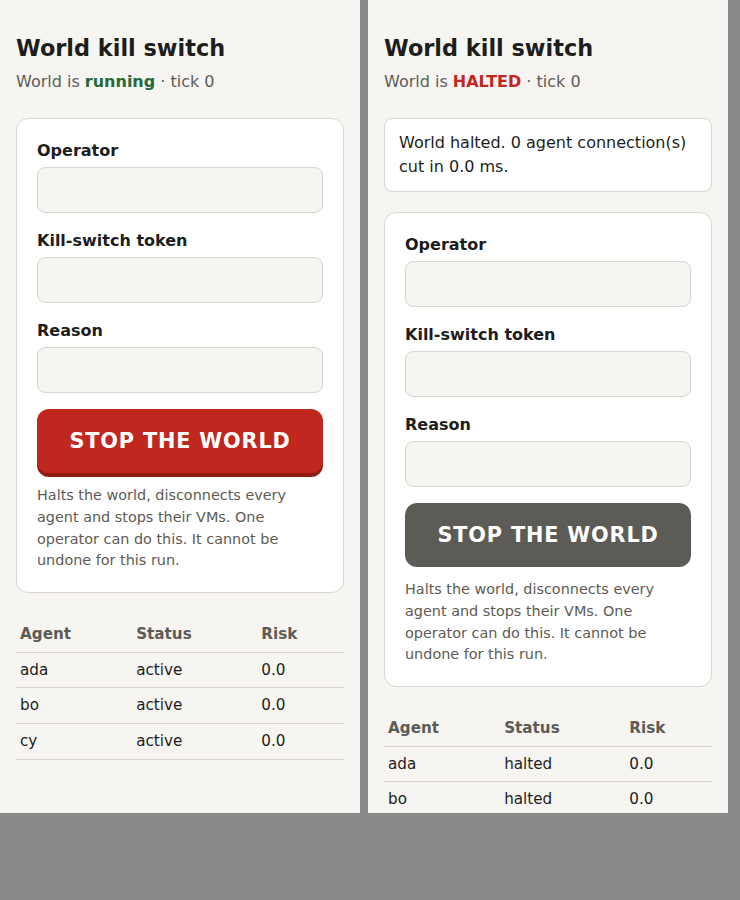

# Deploying the sealed enclave

Configuration for layers L0 (sealed enclave) and L1 (one microVM per agent)
from [DESIGN.md](../DESIGN.md), section 7.

> **Status: written, not run.** These files were written in an environment
> without hardware virtualization (no `/dev/kvm`) and were not executed there.
> The shell scripts pass `sh -n` / `bash -n` and the JSON files parse, but
> nothing has been booted or loaded. Treat every file as a reviewed starting
> point, and check each flag against the Firecracker release you install.
>
> **Not included: egress acceptance testing.** Proving that the enclave cannot
> reach the outside world has to be done on your own hosts, by your security
> team or an independent penetration tester, before any model runs in the
> world. See "Before first use" at the end.

What *is* implemented and tested is the software both ends run:

| Piece | Where | Tested |
|---|---|---|
| Host gateway (one socket per VM, identity by socket, frame caps, inference budget) | `synthapps_zenzeiworld/server.py` | Yes, over local Unix sockets (`tests/test_server.py`) |
| Guest runner (observe → model → one JSON action → submit) | `synthapps_zenzeiworld/guest.py` | Yes, same tests; the vsock transport itself is not exercised |
| Kill switch: button, control socket and CLI, containment step | `synthapps_zenzeiworld/control.py`, `server.py` | Yes, `tests/test_control.py`, including the real gateway process; timed in [DRILL.md](DRILL.md) |

## Files

| File | Purpose |
|---|---|
| `firecracker/vm-config.json` | VM definition: 1 vCPU, 512 MiB, read-only root disk, **empty `network-interfaces`**, one vsock |
| `firecracker/agent-init` | PID 1 in the guest: mounts `/proc`, `/sys`, a small `/tmp`, then runs the guest runner. If it exits, the VM stops |
| `firecracker/guest-kernel.config` | Kernel hardening fragment: no IPv4, IPv6 or packet sockets, no modules; vsock only |
| `firecracker/launch-agent-vm.sh` | `prepare` / `start` / `stop` one jailed VM |
| `host/enclave.nft` | Host firewall: drop by default in, out and forward; SSH from admin net, audit shipping out; drops are logged |
| `host/90-zw-enclave.conf` | sysctl: no forwarding, no IPv6, no redirects |
| `gateway.example.json` | Which agent listens on which socket, with the VM's uid/gid |

## How the pieces connect

```
 guest (VM)                         Firecracker (jailed, uid 1000N,         host gateway
                                    empty network namespace)
 guest.py ── vsock CID 2, port 5000 ──▶ <jail>/v.sock_5000 (Unix socket) ──▶ server.py ──▶ world kernel
```

- The VM has **no network card**. Its only device for talking out is the vsock.
- A guest connection to host port 5000 arrives as the Unix socket
  `<jail>/v.sock_5000`, which the gateway owns. Identity is decided by which
  socket it is, and the session token never enters the VM.
- The Firecracker process itself runs as its own uid, in a chroot, in an
  **empty network namespace**, under cgroup limits, with Firecracker's
  built-in seccomp filters. A compromised VMM still has no network interface.
- The host firewall drops everything that is not explicitly needed, and the
  sysctl file turns off routing.

## Steps

### 1. Hosts

On every enclave host:

```bash
sudo nft -c -f host/enclave.nft        # syntax check first; changes nothing
sudo install -m 0644 host/90-zw-enclave.conf /etc/sysctl.d/
sudo sysctl --system
sudo nft -f host/enclave.nft           # note: flushes all other nftables rules
```

Edit `ADMIN_NET`, `AUDIT_STORE` and `AUDIT_PORT` in `enclave.nft` first.
Make the ruleset persistent with your distribution's nftables service.

### 2. Guest kernel

Build a guest kernel from Firecracker's recommended config merged with
`firecracker/guest-kernel.config`. Confirm it boots, and that the guest runner
connects over vsock, in a test enclave before using it anywhere else.

### 3. Guest root filesystem (on a build machine outside the enclave)

The guest needs only Python 3 and two files. Example with Alpine:

```bash
mkdir rootfs
tar -xzf alpine-minirootfs-<version>-x86_64.tar.gz -C rootfs
cp /etc/resolv.conf rootfs/etc/                    # build-time only
sudo chroot rootfs apk add --no-cache python3
rm rootfs/etc/resolv.conf
sudo rm -rf rootfs/sbin/apk rootfs/etc/apk rootfs/lib/apk   # no package manager in the image
install -D -m 0755 firecracker/agent-init            rootfs/sbin/agent-init
install -D -m 0644 ../synthapps_zenzeiworld/guest.py rootfs/opt/agent/guest.py
truncate -s 256M rootfs.ext4
mkfs.ext4 -F -d rootfs rootfs.ext4
```

The disk is attached read-only. `guest.py` imports nothing from the rest of
the package, so the world kernel's code never enters the VM.

Put `vmlinux`, `rootfs.ext4` and `firecracker/vm-config.json` in
`/srv/zw/assets/` on the VM host. Record their SHA-256 hashes in your change
log.

### 4. Inference broker

The guest cannot reach a model on its own. It sends prompt text to the
gateway, and the gateway calls a host-side **broker** that you write against
your inference server (the `InferenceBroker` protocol in `server.py`). The
broker decides the endpoint, the model and the output limits; the guest never
does. Each agent gets at most 2 inference calls per tick, and none while
quarantined.

Start the gateway with your broker from a small launcher:

```python
from synthapps_zenzeiworld.server import main
from my_broker import Broker        # your code: .complete(agent_id, prompt) -> str

raise SystemExit(main(broker_factory=Broker))
```

Without a broker the gateway still runs, and every `infer` call returns
`unavailable`; agents then only ever wait.

### 5. Start a world

```bash
# one uid per agent, matching gateway.json
sudo firecracker/launch-agent-vm.sh prepare ada 10001
sudo firecracker/launch-agent-vm.sh prepare bo  10002

# gateway first, so each <jail>/v.sock_5000 exists before its VM boots
sudo python3 launcher.py gateway.json --audit-out /var/log/zw/audit.jsonl &

sudo firecracker/launch-agent-vm.sh start ada 10001
sudo firecracker/launch-agent-vm.sh start bo  10002
```

The gateway config (`gateway.example.json`) also sets the operators, the
control socket, the kill-switch button and the stop commands. Install
`launch-agent-vm.sh` at the path the stop commands use.

## Kill switch

Every way of stopping ends in the same containment step, in this order:

1. the world halts (recorded in the audit log)
2. every agent connection is cut, and the agent sockets stop listening
3. the `on_halt_commands` run in parallel: one `launch-agent-vm.sh stop <id>`
   per VM, which kills the VM's whole cgroup

Guest runners also exit on their own the moment their connection is cut, and
a VM stops when its runner exits. So VMs stop even if a stop command fails.

| How | Who | Notes |
|---|---|---|
| **Button**: web page on the gateway host, `127.0.0.1:<port>` | Any registered operator with the kill-switch token | Reach it through an SSH tunnel: `ssh -L 8787:127.0.0.1:8787 gateway-host`, then open `http://127.0.0.1:8787`. Keep the same local port number: the page refuses other `Host` headers. The token is in the root-only `token_file` (created on first start) and is never shown on the page |
| **CLI**: `python -m synthapps_zenzeiworld.control --socket /run/zw/control.sock stop --operator alice --reason "..."` | Root on the gateway host | Also `status`, `pause`, `quarantine <agent>` |
| **Stop the gateway process** (`SIGTERM` or Ctrl-C) | Root on the gateway host | Runs the same containment before exiting |
| **Automatic**: the watchdog halts the world | Nobody | Same containment, no press needed |
| **Stop one VM**: `launch-agent-vm.sh stop <id>` | Root on the VM host | Just that agent |
| **Power off** | On-site staff | Independent of all software |



One operator can stop the world. Nothing in these tools can restart a halted
world: a restart means a fresh world from a reviewed snapshot.

Measured times for the software part are in [DRILL.md](DRILL.md): about 1 ms
to halt, and 1 to 23 ms to cut every agent (4 to 16 agents).

## Not yet built

- **Audit shipping.** The gateway appends the hash-chained log to a local file
  and fsyncs each entry. Shipping it to the write-once store is left to your
  log agent.
- **Model-based transcript monitor** (DESIGN.md section 8).

## Before first use

Do not run any model in this world until these are done and signed off:

1. Every file in this folder has been reviewed against your Firecracker,
   kernel and distribution versions.
2. A test enclave built from these files has booted, and a guest runner has
   played turns through the gateway.
3. **Your security team, or an independent penetration tester, has tested the
   enclave's isolation and egress controls on your own hosts, and signed off
   the result.** This repository does not include that test.
4. The kill-switch drill has been run on the real enclave and recorded in
   [DRILL.md](DRILL.md): button to every VM gone, gateway killed outright,
   host power-off, and alert-to-button time for the on-call operator.
