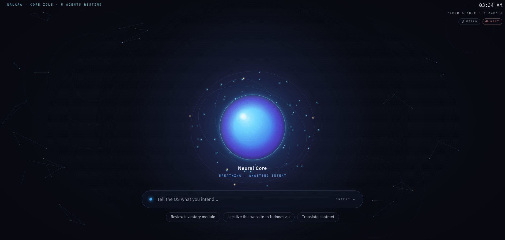

# Nalara

An AI-native operating system where Claude is the kernel. You state an intent;
the kernel classifies it, assembles a workspace of files, memory and tools,
summons a swarm of specialist agents, runs them under platform-enforced safety
rules, and merges their results through a Commander Agent. Everything appears on
an infinite canvas: files are graph nodes, agents are the processes, and apps
are temporary forms of intent.



**Status:** working runtime. It runs fully offline with a heuristic Intent
Engine and rule-based agents; with Claude credentials it uses Claude for intent
classification, planning and agents. The Claude path is tested against a
stand-in client only: no real API call has been made from this repository's
tests.

## Desktop app (double-click)

Nalara also comes as one file you double-click, like a game. Nothing else needs
to be installed: the file carries its own copy of Node.js, the kernel, the UI and
a sample project.

| System | File | How to start it |
|---|---|---|
| Windows 10/11 (x64) | `Nalara-win-x64.exe` | Double-click. The first time, Windows SmartScreen says it "protected your PC": click **More info**, then **Run anyway**. |
| macOS 11+ (Apple Silicon) | `Nalara-darwin-arm64.zip` | Double-click the zip, then **Nalara.app**. The first time, macOS says it cannot verify the developer: open **System Settings → Privacy & Security** and click **Open Anyway**. |
| macOS 11+ (Intel) | `Nalara-darwin-x64.zip` | As above. |
| Linux (x64) | `Nalara-linux-x64.tar.gz` | Unpack, then double-click `Nalara-linux-x64` or run `./Nalara-linux-x64`. |

The warnings appear because the files are not signed with a paid Apple or
Microsoft developer certificate. They are built from this repository by
[`.github/workflows/nalara-app.yml`](../.github/workflows/nalara-app.yml): run it
from the Actions tab (or push a `nalara-v*` tag to attach the files to a
release) and download them from the run's artifacts.

What happens when you start it:

- Your home folder for Nalara is `Nalara` in your user folder (for example
  `C:\Users\you\Nalara`). The first start creates it with a sample project
  inside. Put the projects you want Nalara to work on in this folder.
- The Neural Core opens in its own window (Edge, Chrome, Chromium or Brave in
  app mode, with no tabs or address bar). Without any of those, it opens in your
  default browser.
- Closing the window stops Nalara about 20 seconds later; plans that were still
  running resume next time. Starting it again while it runs just opens another
  window.
- On Windows a console window shows what Nalara is doing; keep it open. Without
  a console (the Mac app), the same text goes to `Nalara/.nalara/app.log`.
- It runs offline unless `ANTHROPIC_API_KEY` is set in the environment.

Options (from a terminal): `--fullscreen`, `--root DIR`, `--port N`,
`--no-open`, `--stay` (keep running after the window closes), `--offline`,
`--check` (self-test), `--help`.

To build the file yourself: `npm install`, then `npm run build:app` (for the
computer you are on) or `npm run build:app -- --target win-x64` (a Windows build
from Linux or macOS). macOS builds need a Mac. Output goes to `dist-app/`.

## Quick start (from source)

Requires Node.js 22.13 or newer.

```bash
cd nalara
npm install
npm run build                      # builds the Nalara UI into web/dist
npm start -- --root demo/breath-of-fire-iv-remake
```

On Windows PowerShell 5.1, which does not accept `&&`, run the steps one per
line, with a backslash in the path:

```powershell
cd nalara
npm install
npm run build
npm start -- --root demo\breath-of-fire-iv-remake
```

Windows is supported in the code (paths, file watching, killing a command's
whole process tree) but has not been tested on a Windows machine; everything
above was tested on Linux.

Open http://127.0.0.1:7437 and type an intent in the bar under the Neural Core,
for example **Review inventory module**, **Build inventory feature**, **Localize
this website to Indonesian** or **Translate contract**. The agents the kernel
summons orbit the core while they work; an approval appears above the bar, and
the results slide in when the workspace completes. Click the core for the root
radial menu (Search, Files, Agents, Projects, Apps, Memory, Settings); click an
agent in orbit for its own menu. **Field** (top right) shows the knowledge
graph; **Halt** is the kill switch. Screenshots of each state are in
[docs/screenshots/](docs/screenshots/).

To use Claude, make credentials available before starting (for example
`export ANTHROPIC_API_KEY=...`, or a profile from `ant auth login`). The status
line says `mode: claude` or `mode: offline`. `--offline` forces offline mode.
The default model is `claude-opus-5` (`NALARA_MODEL` to change).

From the terminal:

```bash
npm run cli -- intent "Review inventory module" --root demo/breath-of-fire-iv-remake --wait
npm run cli -- search "latest damage calculations" --root demo/breath-of-fire-iv-remake
npm run cli -- approvals          # on a running server
npm run cli -- approve <id>
npm run cli -- halt "stop everything"
npm run cli -- tree <workspaceId>       # process tree: builders, critics, verdicts
npm run cli -- observatory              # usage per fleet and agent
npm run cli -- queue                    # approvals, running agents, waiting workspaces
printf %s "$TOKEN" | npm run cli -- secret set GITHUB_TOKEN   # value from stdin (a terminal prompt shows the input)
npm run cli -- --help
```

Nalara writes its database and outputs to `<root>/.nalara/`.

## What it does

| Spec component (DESIGN.md) | In the runtime |
|---|---|
| Intent Engine (3.1) | Classifier, enricher, context loader, priority engine and planner. Claude with structured output, or a catalog of 14 intent classes |
| Agent Orchestrator (3.2) | Enforced lifecycle (dormant → summoned → active → collaborating → completed → archived), plan DAGs, concurrency lanes, budgets, checkpoints |
| Workspace Generator (3.3) | Workspaces with member files, tools, agents, an output folder and generated resources (glossary, style guide, coding standards) |
| Knowledge Graph (3.4) | SQLite-backed graph of projects, folders, files, concepts, agents, tools, workspaces, outputs and their relations |
| Memory Service (3.5) | Preferences, project history, decisions, standards, translation guides, file relations, agent performance; seeded from the project |
| Neural Canvas (4) | The Neural Core UI, live over server-sent events; the knowledge graph as a React Flow "Field" view |
| Radial OS (5) | Root, agent, file, project, workspace, MCP and workflow menus with the spec's actions |
| Agents (6) | 27 agents in four groups, each following `schemas/agent.schema.json`, with rule-based offline skills |
| Intent-based execution (7) | The four spec examples produce the workspaces the spec describes |
| MCP (8) | Stdio and HTTP servers; tools discovered at run time and classed read / write / search / execute |
| Filesystem by meaning (9) | Semantic search with concepts, recency, kind filters and graph relations |
| Events (10) | Persistent event bus and the File Changed → Review → QA → Documentation trigger chain |
| Fleets (beyond the spec) | Process tree per run, adversarial review (builders attacked by critics; only evidence-checked challenges block), an audited relay, fleet memory, fleet budgets, an Observatory and a work queue. See [ARCHITECTURE.md](ARCHITECTURE.md#fleets) and [docs/orc-gap-analysis.md](docs/orc-gap-analysis.md) |

## Safety

The platform enforces the rules; prompts only explain them. Every tool call
passes one gateway and every model call one governor. Details and the tool
register are in [SAFETY.md](SAFETY.md).

- **Approvals:** tools are classed reversible, compensable or irreversible.
  In the default `ask` policy, project writes, test runs, deploys and MCP writes
  wait for your approval (the approval card above the intent bar, which shows
  the exact command, or `nalara approve`).
- **Undo:** project file writes are journaled; *Undo writes* on a workspace
  restores them, and refuses if you changed the file since.
- **Kill switch:** *Halt* in the UI (or `nalara halt`) stops every agent and
  denies every non-read tool until you resume. Agents cannot reach it.
- **Scope and delegation:** each agent can call only its own tools; trigger
  chains stop at depth 3.
- **Memory:** anything an agent saves stays *proposed* until you confirm it.
- **Audit:** an append-only, hash-chained ledger of every decision.
- **Budgets:** per-agent limits on tokens, tool calls, turns and time, with
  repeat-call detection, plus a per-run fleet budget (agents, tokens, tool
  calls, relay messages).
- **Secrets:** MCP credentials go in the secret store (Settings → Secrets, or
  `nalara secret set`) and are referenced as `${secret:NAME}`. Agents never see
  them, and stored values are removed from tool results, events, the audit
  ledger and API responses.
- **Network:** the server binds to 127.0.0.1 and has no authentication. Do not
  expose it.

Known gap: agents run inside the kernel's Node.js process and test/deploy
commands run as ordinary child processes (scrubbed environment, timeout, root as
working directory), without OS-level isolation. Point Nalara only at code you
would run yourself.

## Layout

- [ARCHITECTURE.md](ARCHITECTURE.md): module map and conventions.
- [SAFETY.md](SAFETY.md): the platform safety design.
- [DESIGN.md](DESIGN.md): the original specification.
- [CLAUDE.md](CLAUDE.md): the kernel prompt, loaded by Claude Code in this folder.
- `src/`: the kernel. Contracts in `src/kernel/types.ts`, HTTP API in
  `src/server/api-contract.ts`.
- `web/`: the UI (the Neural Core), plus a mock kernel and smoke test in `web/mock/`.
- `demo/breath-of-fire-iv-remake/`: a small original game project to try it on.
- `schemas/`: JSON Schemas for intents, graph nodes and agents.
- `design/`: the earlier Claude Design canvas artboards (they render inside the
  Claude Design canvas only). The current UI follows
  [docs/design-target.webp](docs/design-target.webp).

## Tests

```bash
npm test              # unit and integration tests (Vitest)
npm run typecheck
npm run test:e2e      # the UI against a real kernel in headless Chromium
NALARA_DOCS_SHOTS=1 npm run test:e2e   # also refreshes docs/screenshots/
```

The integration tests run all four spec intents offline on a copy of the demo,
plus crash-and-resume, the trigger chain, halt and resume, proposed memory and
undo.
