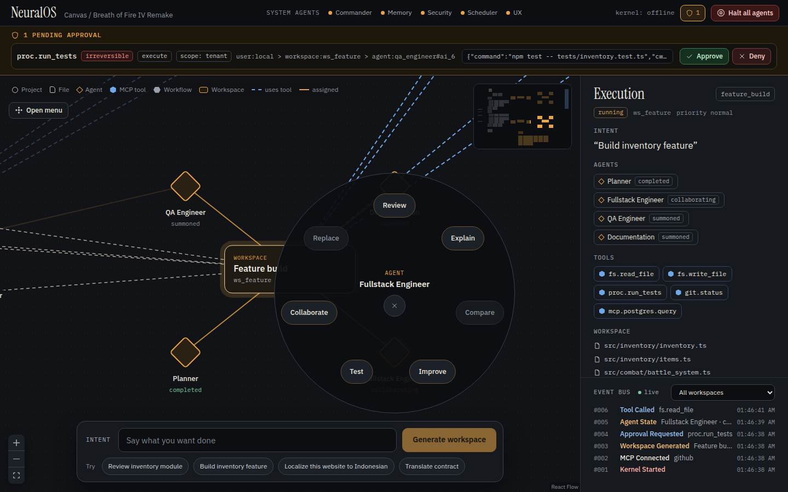

# NeuralOS

An AI-native operating system where Claude is the kernel. You state an intent;
the kernel classifies it, assembles a workspace of files, memory and tools,
summons a swarm of specialist agents, runs them under platform-enforced safety
rules, and merges their results through a Commander Agent. Everything appears on
an infinite canvas: files are graph nodes, agents are the processes, and apps
are temporary forms of intent.



**Status:** working runtime. It runs fully offline with a heuristic Intent
Engine and rule-based agents; with Claude credentials it uses Claude for intent
classification, planning and agents. The Claude path is tested against a
stand-in client only: no real API call has been made from this repository's
tests.

## Quick start

Requires Node.js 22.13 or newer.

```bash
cd neuralos
npm install
npm run build                      # builds the Neural Canvas UI into web/dist
npm start -- --root demo/breath-of-fire-iv-remake
```

On Windows PowerShell 5.1, which does not accept `&&`, run the steps one per
line, with a backslash in the path:

```powershell
cd neuralos
npm install
npm run build
npm start -- --root demo\breath-of-fire-iv-remake
```

Windows is supported in the code (paths, file watching, killing a command's
whole process tree) but has not been tested on a Windows machine; everything
above was tested on Linux.

Open http://127.0.0.1:7437 and type an intent in the bar at the bottom, for
example **Review inventory module**, **Build inventory feature**, **Localize
this website to Indonesian** or **Translate contract**. Click empty canvas for
the root radial menu; click any node for its own menu.

To use Claude, make credentials available before starting (for example
`export ANTHROPIC_API_KEY=...`, or a profile from `ant auth login`). The status
line says `mode: claude` or `mode: offline`. `--offline` forces offline mode.
The default model is `claude-opus-5` (`NEURALOS_MODEL` to change).

From the terminal:

```bash
npm run cli -- intent "Review inventory module" --root demo/breath-of-fire-iv-remake --wait
npm run cli -- search "latest damage calculations" --root demo/breath-of-fire-iv-remake
npm run cli -- approvals          # on a running server
npm run cli -- approve <id>
npm run cli -- halt "stop everything"
npm run cli -- --help
```

NeuralOS writes its database and outputs to `<root>/.neuralos/`.

## What it does

| Spec component (DESIGN.md) | In the runtime |
|---|---|
| Intent Engine (3.1) | Classifier, enricher, context loader, priority engine and planner. Claude with structured output, or a catalog of 14 intent classes |
| Agent Orchestrator (3.2) | Enforced lifecycle (dormant → summoned → active → collaborating → completed → archived), plan DAGs, concurrency lanes, budgets, checkpoints |
| Workspace Generator (3.3) | Workspaces with member files, tools, agents, an output folder and generated resources (glossary, style guide, coding standards) |
| Knowledge Graph (3.4) | SQLite-backed graph of projects, folders, files, concepts, agents, tools, workspaces, outputs and their relations |
| Memory Service (3.5) | Preferences, project history, decisions, standards, translation guides, file relations, agent performance; seeded from the project |
| Neural Canvas (4) | React Flow canvas with the spec's node shapes, live over server-sent events |
| Radial OS (5) | Root, agent, file, project, workspace, MCP and workflow menus with the spec's actions |
| Agents (6) | 27 agents in four groups, each following `schemas/agent.schema.json`, with rule-based offline skills |
| Intent-based execution (7) | The four spec examples produce the workspaces the spec describes |
| MCP (8) | Stdio and HTTP servers; tools discovered at run time and classed read / write / search / execute |
| Filesystem by meaning (9) | Semantic search with concepts, recency, kind filters and graph relations |
| Events (10) | Persistent event bus and the File Changed → Review → QA → Documentation trigger chain |

## Safety

The platform enforces the rules; prompts only explain them. Every tool call
passes one gateway and every model call one governor. Details and the tool
register are in [SAFETY.md](SAFETY.md).

- **Approvals:** tools are classed reversible, compensable or irreversible.
  In the default `ask` policy, project writes, test runs, deploys and MCP writes
  wait for your approval (approvals bar, or `neuralos approve`).
- **Undo:** project file writes are journaled; *Undo writes* on a workspace
  restores them, and refuses if you changed the file since.
- **Kill switch:** *Halt all agents* (or `neuralos halt`) stops every agent and
  denies every non-read tool until you resume. Agents cannot reach it.
- **Scope and delegation:** each agent can call only its own tools; trigger
  chains stop at depth 3.
- **Memory:** anything an agent saves stays *proposed* until you confirm it.
- **Audit:** an append-only, hash-chained ledger of every decision.
- **Budgets:** per-agent limits on tokens, tool calls, turns and time, with
  repeat-call detection.
- **Network:** the server binds to 127.0.0.1 and has no authentication. Do not
  expose it.

Known gap: agents run inside the kernel's Node.js process and test/deploy
commands run as ordinary child processes (scrubbed environment, timeout, root as
working directory), without OS-level isolation. Point NeuralOS only at code you
would run yourself.

## Layout

- [ARCHITECTURE.md](ARCHITECTURE.md): module map and conventions.
- [SAFETY.md](SAFETY.md): the platform safety design.
- [DESIGN.md](DESIGN.md): the original specification.
- [CLAUDE.md](CLAUDE.md): the kernel prompt, loaded by Claude Code in this folder.
- `src/`: the kernel. Contracts in `src/kernel/types.ts`, HTTP API in
  `src/server/api-contract.ts`.
- `web/`: the Neural Canvas UI, plus a mock kernel and smoke test in `web/mock/`.
- `demo/breath-of-fire-iv-remake/`: a small original game project to try it on.
- `schemas/`: JSON Schemas for intents, graph nodes and agents.
- `design/`: the Claude Design canvas artboards the UI follows. They render
  inside the Claude Design canvas only.

## Tests

```bash
npm test              # unit and integration tests (Vitest)
npm run typecheck
npm run test:e2e      # the UI against a real kernel in headless Chromium
```

The integration tests run all four spec intents offline on a copy of the demo,
plus crash-and-resume, the trigger chain, halt and resume, proposed memory and
undo.
