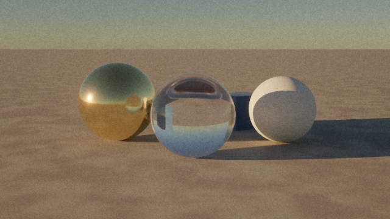
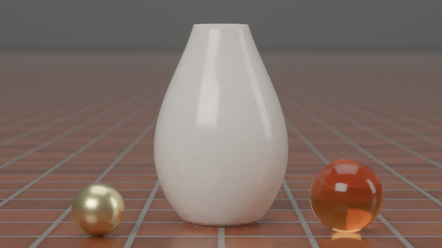
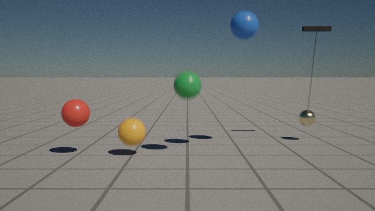
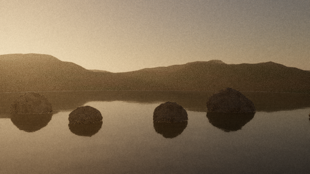
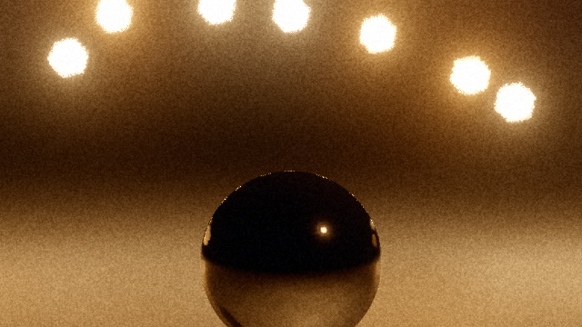
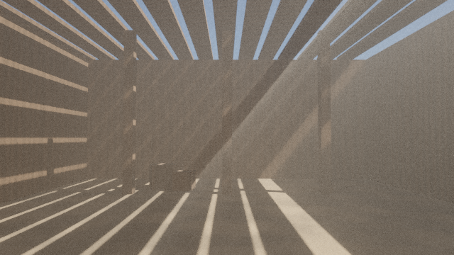

# reality.js

A small scene language and a physically based path tracer for the browser.
Describe a shot in a few lines of text; get images and video that behave
like photographs and film: real light, a real camera, real motion.

```
camera { lens: 50mm, aperture: f/2.8 }
sky { sun_elevation: 9 }                     # golden hour
ground { }
sphere {
  position: [0, 0.5 + bounce(t, 2m), 0]      # dropped from 2 m, bouncing
  radius: 0.5
  material: metal { color: gold, roughness: 0.15 }
}
timeline { duration: 3s }
```

<table>
<tr>
<td></td>
<td></td>
<td></td>
</tr>
<tr>
<td></td>
<td></td>
<td></td>
</tr>
</table>

*Rendered with `tools/render.mjs` at 640×360 on Chromium's CPU renderer
(SwiftShader). The volumetric barn scene is still slightly noisy at the
sample count used here.*

## What makes it look real

- **Light is path traced**, not approximated: soft shadows from lights
  with real sizes, light bouncing between surfaces, glass and water that
  refract and absorb, fog that scatters sunlight into shafts.
- **Light has real units.** A physically based sky and sun (about
  100,000 lux at noon), bulbs in lumens, colour temperatures in kelvin.
  Mixing a lamp with daylight needs no tuning.
- **The camera is a camera.** Focal length and sensor size set the field
  of view; the f-number sets depth of field; aperture blades shape the
  bokeh; the shutter time sets motion blur; ISO, aperture and shutter set
  exposure exactly as on a real camera (the "sunny 16" rule works), or
  auto exposure meters for you.
- **Motion is physical and blur is exact.** `bounce`, `spring`,
  `pendulum`, `fall` and hand-held `wobble` are closed-form functions of
  time; every light path samples its own instant inside the shutter.
- **Film, not a screen.** AgX tone mapping, white balance, grain, lens
  glare, halation and natural vignetting.
- **Video out.** Frames are encoded with WebCodecs at exact timestamps
  into WebM, so slow renders still play at the right speed.

## reality.js or three.js?

They solve different problems. **three.js** is a real-time 3D engine: use
it for anything interactive at 60 fps. **reality.js** is an offline
renderer: a frame takes seconds to minutes, and in return the lighting,
camera and motion blur are physically based by default and a whole shot
fits in a few lines of text. [DESIGN.md](DESIGN.md) explains the trade in
detail, including what reality.js does not do yet.

## Quick start

No build step and no dependencies. Serve the folder and open the
playground:

```bash
cd reality-js
npm run serve            # or: node tools/serve.mjs 8080
# open http://localhost:8080/playground/
```

The playground has an editor with live, progressively refining preview,
a time slider for animated scenes, and buttons to render the final image
(PNG) and video (WebM). It needs WebGL2 with float render targets
(`EXT_color_buffer_float`). It is tested in Chromium; other current
browsers with those features should work. Where WebCodecs is missing,
video comes out as numbered PNG frames instead of WebM.

## Live demo

`demo/` is a small interactive page built on reality.js: pick a light,
a material and an aperture, drop the ball, and watch the frame being
traced on your GPU with live frames-per-second and paths-per-second
readouts and a 4-second benchmark. Open
`http://localhost:8080/demo/` after `npm run serve`.

## Render from the command line

`tools/render.mjs` drives headless Chromium through
[Playwright](https://playwright.dev) (`npm i -D playwright`, or a global
install):

```bash
node tools/render.mjs examples/golden-hour.real -o golden.png --samples 512
node tools/render.mjs examples/bouncing-balls.real --video -o balls.webm
node tools/render.mjs examples/lake.real --frames out/ --size 1920x1080
node tools/render.mjs examples/hello.real --gpu        # use the GPU
```

By default it renders on the CPU (SwiftShader), which works anywhere but
is slow; `--gpu` uses the graphics card when Chromium can reach one.

## Use it from JavaScript

```js
import { Reality, renderVideo } from './src/index.js';

const reality = new Reality(canvas, { baseUrl: location.href });
await reality.load(sourceText);   // throws RealityError; err.format(source) explains it
reality.start();                  // progressive preview in the canvas

const png = await reality.renderStill({ samples: 512 });
const { blob } = await renderVideo(reality, { samples: 64 });
```

The language front end (`compile`, `parse`, the scene model, the sky
model, mesh generators) also runs in Node without a GPU.

## Learn the language

- [LANGUAGE.md](LANGUAGE.md): the guide and the full reference of every
  kind of object, material and setting.
- [examples/](examples/): seven commented scenes, from `hello.real` to
  animated physics and a hand-held lake shot.

## Tests

```bash
npm test                  # 74 unit tests, about 1 s, Node only
npm run test:browser      # 10 rendering tests in headless Chromium
```

The rendering tests include white-furnace tests: white diffuse, mirror and
glass spheres inside a uniform environment must disappear, which fails if
the renderer gains or loses energy anywhere.

## Layout

```
src/lang/       lexer, parser, evaluator, time signals, built-in functions
src/scene/      node schemas, scene model, camera maths, motion helpers
src/geometry/   BVH, OBJ reader, torus / terrain / rock generators
src/sky/        atmosphere model, HDR reader, environment sampling
src/render/     GPU data packing, path-tracing and post-process shaders, WebGL2 renderer
src/video/      WebM writer and timeline recorder
src/reality.js  ties it together
playground/     the editor
examples/       scenes, plus generated assets (tools/make-assets.mjs)
tools/          static server, render CLI, asset and docs generators
```

## Licence

MIT, as the rest of this repository.
